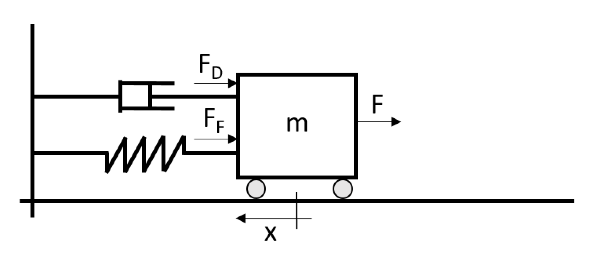

# Mass Spring Damper Simulation

Plots the graph for the position and velocity of the mass, based on a user given the starting position and velocity over 
a specified time also given by the user. The values for the mass, spring, and damper are constant.

* The mass is 1.0
* The spring constant is 0.50
* The damper constant is 0.25

The sampling rate is also specified by the user. **It should be less than  0.01, 
otherwise it will result in wrong values.**

After calculating the values, [gnuplot](http://www.gnuplot.info/) is used to draw the graphs. For it to work, gnuplot 
needs to be in inside your system's `PATH` environment variable;

*The template for the exercise determined the project file structure as requirement.*

## Non-periodic movement

Given the following parameters, the task is to find a damper constant, at which point the movement of the weight is not
periodic.

* The mass is 1.0
* The spring constant is 2.0
* The starting position is 1.0
* The starting velocity 0.0

To check if the plot is periodic, we can modify the code to exit early, once the position of the mass is a negative 
value. The simulation duration should be long enough to assure a more accurate result.

One spring constant is guess, for which the movement is periodic, and another, for which the movement non-periodic.
The next value to try then becomes the middle between those two guessed values. Dependent on the simulation result,
this value becomes the new upper or lower bound.

After a few times I came to the result, that the damper constant needs to be at least `2.83165`. Rounded to two 
significant digits as the provided values imply, the damper constant needs to be at least `2.9`.

## Special Notes For Windows
This program uses the `tmpfile` function provided by the C standard library, which
is absolutely ridiculous implemented in Windows. Instead of creating the temporary file inside the user's directory for 
temporary files, it creates them in `C:\`. Writing into `C:\` requires privileges. Therefor, you might need to run this
program as privileged user.

*The only real alternative would be to use the Win32 API, which turns this simple function call into a whole routine, 
and even then it still does not guarantee that the temporary files will be removed if the program closes.*
